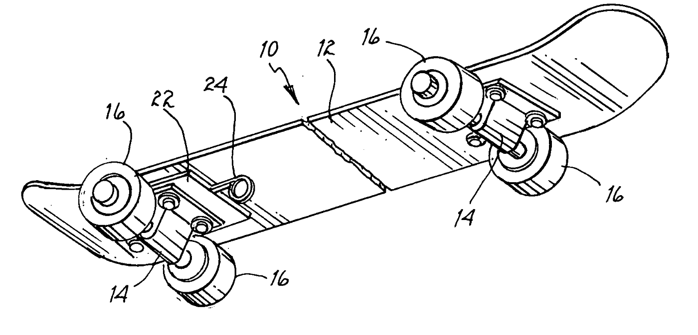

# Framework Front-End I - Angular

## O que é?

Angular é um **_framework_** JavaScript, de código aberto, mantido pela Google para a construção de **_SPA_** (sigla para Single Page Applications ou Aplicações de Página Única).

Angular é uma reescrita completa do AngularJS, feito pela mesma equipe que o construiu.

---

## O que é framework?

> Framework é uma definição que vai além do mercado de software. Em outros contextos, refere-se a uma série de ações e estratégias que visam solucionar um problema bem específico. (NOLETO, Cairo. Em 13/02/2020)

Trazendo essa definição para a área de tecnologia, podemos definir como um conjunto de recursos prontos que nos oferecem algumas funcionalidades ou a estrutura para desenvolvermos essas funcionalidades.

---

## O que é uma SPA?

Single Page Applications que, em tradução literal, é Aplicações de Página Única, como o próprio nome sugere, são aplicações cujas funcionalidades estão concentradas em uma única página.

Quando interagimos com as página ou navegamos entre elas, ao invés de carregar todo o conteúdo, ela atualiza apenas a parte desejada, por isso a definição de página única.

---

## Angular CLI

A CLI Angular é uma ferramenta de interface de linha de comando que você usa para inicializar, desenvolver, estruturar e manter aplicativos Angular diretamente de um shell de comando.

1. Instalar o NodeJs (https://nodejs.org/en/download/)
2. Instalar a Angular CLI: `npm install -g @angular/cli`

---

## Arquitetura de componentes

É uma arquitetura baseada em componentes independentes, substituíveis e modulares que facilitam o gerenciamento da complexidade e encorajam a reutilização.

---

## Por que componentizar?

1. O problema é dividido em porções menores e mais expressivas.
2. Componentes geralmente representam diferenças nas taxas de mudança de diferentes partes do sistema e têm ciclos de vida diferentes.
3. Eles incentivam a definição e manutenção de um delineamento claro de responsabilidade, o que por sua vez limita o impacto de mudanças e torna o entendimento e a alteração da base de código mais simples.
4. Eles podem dar um grau maior de liberdade na otimização do processo de compilação e implantação.

---

## Vamos componentizar?

---

## Referências e links úteis

- [Documentação Angular](https://angular.io/docs)

- [O que é o Angular e para que serve?](https://www.treinaweb.com.br/blog/o-que-e-o-angular-e-para-que-serve)

- [Framework: o que é, como ele funciona e para que serve?](https://blog.betrybe.com/framework-de-programacao/o-que-e-framework/)

- [Já ouviu falar em Single Page Applications?](https://www.devmedia.com.br/ja-ouviu-falar-em-single-page-applications/39009)

- [Angular CLI](https://angular.io/cli)

- [O que é componentização](https://hnz.com.br/o-que-e-componentizacao/)

- [Como usar seus componentes Angular em qualquer lugar](https://blog.wgbn.com.br/como-usar-seus-componentes-angular-em-qualquer-lugar-3ef1d57c117e)

- [Como adicionar Bootstrap a um aplicativo Angular](https://www.freecodecamp.org/news/how-to-add-bootstrap-css-framework-to-an-angular-application/)